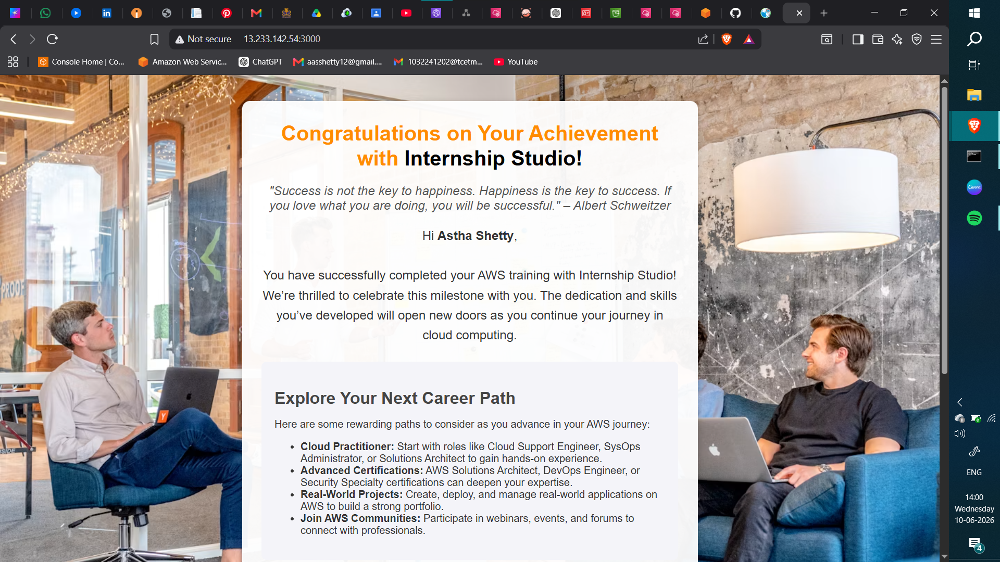
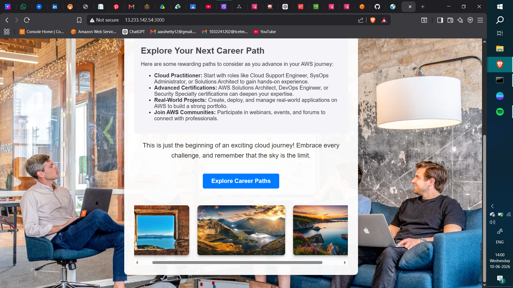
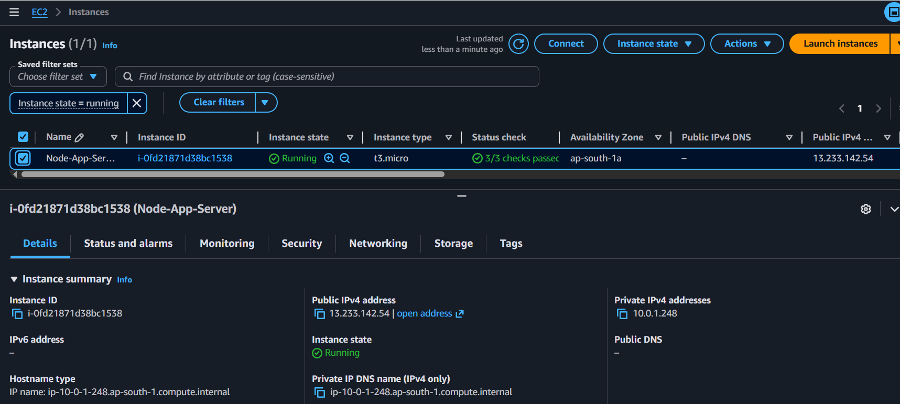
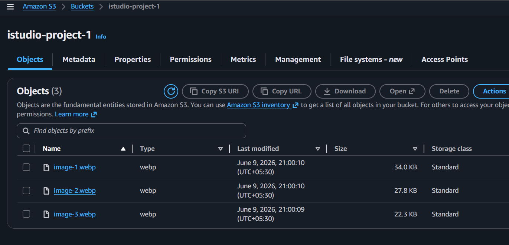
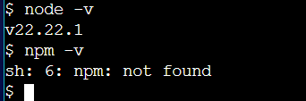
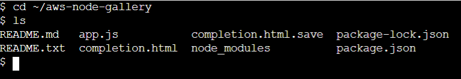

# 🚀 AWS EC2 + S3 Image Gallery Web Application

## 📌 Project Overview

This project demonstrates how to deploy a **Node.js + Express web application on AWS EC2** and integrate it with **Amazon S3 for image storage**. The application displays a simple image gallery and a personalized completion page.

It is designed as a beginner-friendly **cloud deployment project** showcasing AWS fundamentals.

---
## 🚀 Temporary Demo
http://13.233.142.54:3000/
---

## 🏗️ Architecture

```
User Browser
     ↓
AWS EC2 (Ubuntu Server)
     ↓
Node.js + Express Application
     ↓
Amazon S3 (Image Storage)
```

---

## ⚙️ Tech Stack

* **AWS EC2** – Virtual server hosting
* **Amazon S3** – Image storage service
* **Node.js** – Backend runtime
* **Express.js** – Web framework
* **HTML/CSS** – Frontend UI
* **Git & GitHub** – Version control

---

## ✨ Features

* Deployed Node.js application on AWS EC2
* Express server handling web requests
* Image gallery loaded from Amazon S3 bucket
* Public S3 image access integration
* Personalized completion page
* Cloud-based full-stack deployment

---

## 📂 Project Structure

```
aws-node-gallery/
│
├── app.js
├── package.json
├── package-lock.json
├── completion.html
├── views/
├── public/
├── screenshots/
└── README.md
```

---

## 🚀 How It Works

1. User opens the EC2 public IP in browser
2. Node.js app running on EC2 serves the webpage
3. Images are fetched from Amazon S3 bucket
4. Completion page displays personalized message and gallery

---

## 🧑‍💻 Setup Instructions

### 1. Clone Repository

```bash
git clone https://github.com/Astha-S12/aws-node-gallery.git
cd aws-node-gallery
```

### 2. Install Dependencies

```bash
npm install
```

### 3. Run Application

```bash
node app.js
```

### 4. Open in Browser

```
http://<your-ec2-public-ip>
```

---

## ☁️ AWS Services Used

* **Amazon EC2**

  * Hosted Node.js server on Ubuntu instance

* **Amazon S3**

  * Stored and served static images publicly

* **IAM Roles**

  * Provided secure EC2 access to AWS services

---

## 📸 Screenshots

### Final Output 1 (Your completion page & Name replaced correctly)


### Final Output 2 (Images loaded from S3)


### EC2 instance running dashboard


### S3 bucket showing uploaded images


### Node.js + npm installation proof (EC2 terminal)


### EC2 Terminal



---

## 🎯 What I Learned

* Deploying applications on AWS EC2
* Configuring security groups and IAM roles
* Hosting static assets using Amazon S3
* Working with Node.js and Express
* Basic cloud architecture design
* Git and GitHub project deployment

---

## 📌 Future Improvements

* Add domain name (Route 53)
* Enable HTTPS using SSL (Nginx + Certbot)
* Use CloudFront CDN for faster image delivery
* Implement CI/CD pipeline for auto deployment

---

## 👨‍💻 Author

**Astha Shetty**
GitHub: [Astha-S12](https://github.com/Astha-S12)

---
